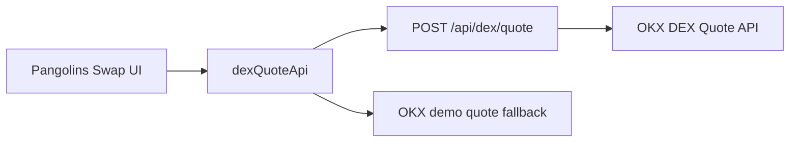

# OKX DEX Quote Integration Design

## Goal

Add a first-stage OKX DEX integration for the Swap page that demonstrates real aggregator product logic without requiring production transaction execution.

## Scope

- Show OKX-style quote data in the existing Pangolins Swap UI.
- Keep Pangolins as the user-facing interface; do not embed the OKX widget.
- Define a BFF contract for `/api/dex/quote`.
- Keep GitHub Pages deploy usable by falling back to deterministic mock quote data when no BFF is available.
- Do not implement approvals, calldata signing, transaction broadcast, or wallet-chain enforcement in this phase.

## Architecture

The frontend calls a local quote adapter. The adapter first tries `POST /api/dex/quote`; if the endpoint is missing, unavailable, or returns an invalid shape, it returns a curated OKX demo quote. The BFF will own OKX API credentials and signing.



## BFF Contract

`POST /api/dex/quote`

Request:

```json
{
  "chainIndex": "1",
  "chainName": "Ethereum",
  "fromTokenAddress": "0xeeeeeeeeeeeeeeeeeeeeeeeeeeeeeeeeeeeeeeee",
  "toTokenAddress": "0xa0b86991c6218b36c1d19d4a2e9eb0ce3606eb48",
  "fromTokenSymbol": "ETH",
  "toTokenSymbol": "USDC",
  "amount": "1000000000000000000",
  "amountLabel": "1.00",
  "swapMode": "exactIn",
  "slippagePercent": "0.3"
}
```

Response:

```json
{
  "quoteId": "okx_demo_eth_usdc",
  "routeId": "okx:ethereum:eth-usdc",
  "expiresAt": "2026-04-25T12:00:00.000Z",
  "providerName": "OKX DEX",
  "summary": "ETH -> USDC via OKX DEX",
  "fromTokenSymbol": "ETH",
  "toTokenSymbol": "USDC",
  "fromAmount": "1.00",
  "toAmount": "1,998.40",
  "estimatedGasUsd": "$2.84",
  "priceImpactPercent": "0.04%",
  "liquiditySources": [
    { "name": "Uniswap V3", "percent": 72 },
    { "name": "Curve", "percent": 28 }
  ],
  "sourceKind": "bff"
}
```

## OKX BFF Notes

- OKX DEX Quote API endpoint: `GET https://web3.okx.com/api/v6/dex/aggregator/quote`.
- The BFF must add `OK-ACCESS-KEY`, `OK-ACCESS-SIGN`, `OK-ACCESS-PASSPHRASE`, and `OK-ACCESS-TIMESTAMP`.
- The signature is HMAC SHA256 over `timestamp + method + requestPath + body`, Base64 encoded.
- The frontend must never receive or store OKX API credentials.

## UI Behavior

- Clicking “获取报价 / Get Quotes” should display OKX DEX as the provider.
- The quote card should show received amount, estimated gas, price impact, and liquidity source split.
- The left swap form should show the quoted buy amount and route-ready banner.
- Existing mocked execution flow remains unchanged after the quote is shown.

## References

- OKX Quote API: https://web3.okx.com/onchainos/dev-docs/trade/dex-get-quote
- OKX Swap API: https://web3.okx.com/onchainos/dev-docs/trade/dex-swap
- OKX API authentication: https://web3.okx.com/onchainos/dev-docs-v5/dex-api/dex-api-access-and-usage
